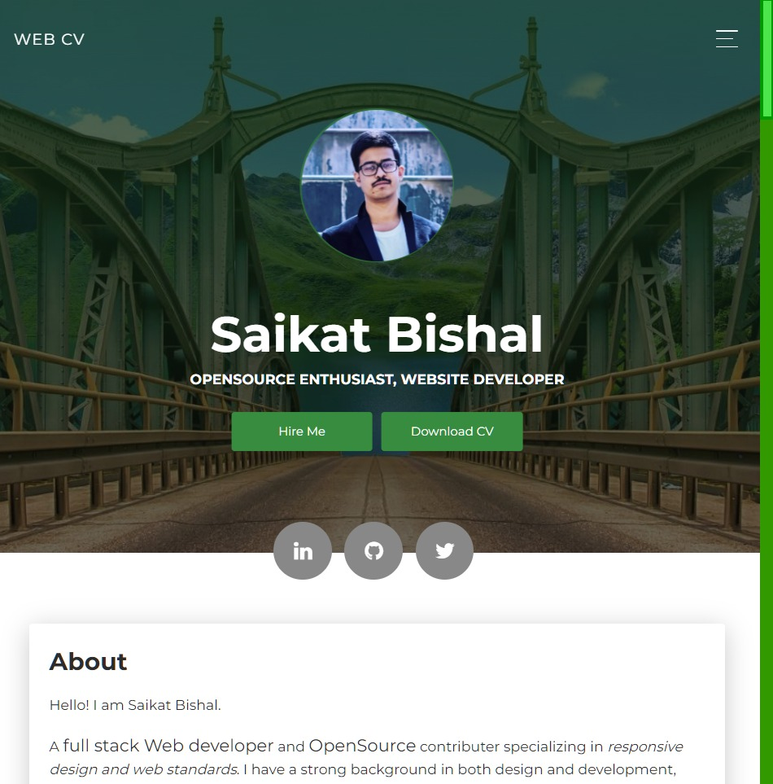
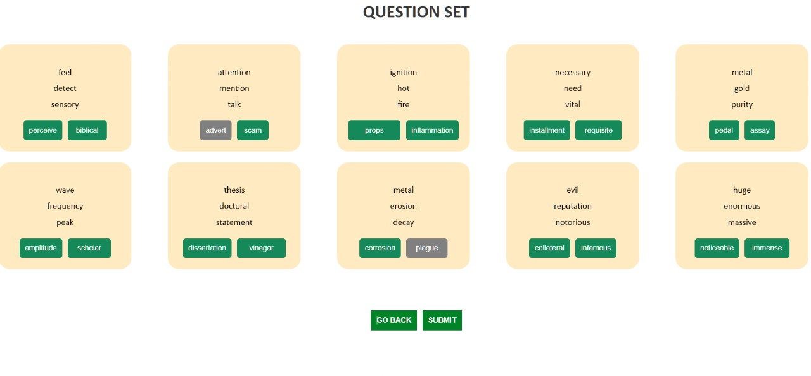
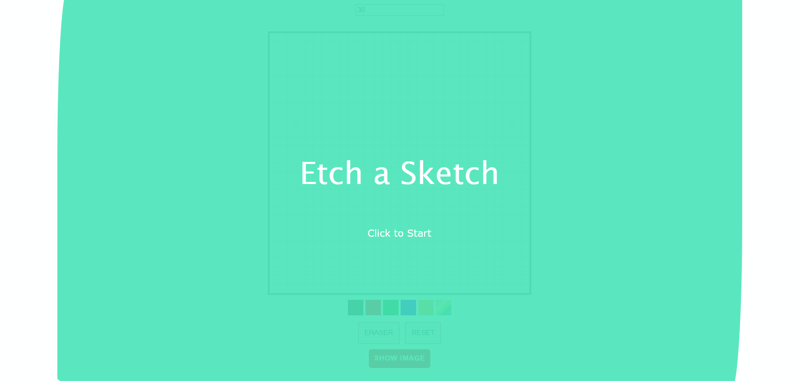
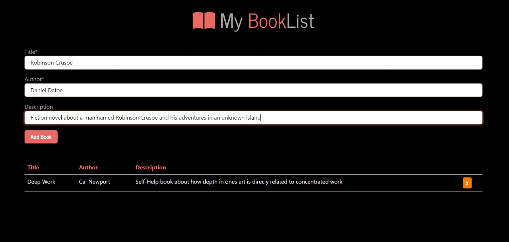
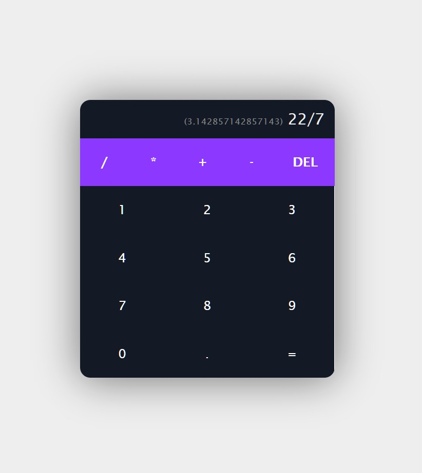

# MINI PROJECTS

## [One page CV](https://developer-resume-livid.vercel.app/)
</img>

## [Vocabulary Quiz Application with levels](https://visionary-bonbon-406fa0.netlify.app/)
</img>

## [Pixel Sketch pad](https://sketch-it-up.vercel.app/)
</img>

## [QR Code Generator](https://qrcodegenerator-jet.vercel.app/)
</img>

## [Rick and Morty Watching you](https://rick-morty-ruby.vercel.app/)
</img>

## [Booklist Application](https://personal-library-4bsb.vercel.app/)
</img>

## [Firebase Simple Chat Application](https://darling-froyo-e19ec2.netlify.app/)
</img>

## [Simple Calculator](https://react-calculator-saikat.netlify.app/)
</img>

